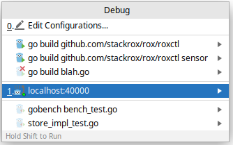

# Debugging go code running in Kubernetes 

This tells how to prepare code and GoLand IDE to debug Go code of the
application running on the cluster.

It works with minikube and GKE/Infra clusters.

It should be possible to use other debugging UIs/front-ends but wasn’t
tested.

## Instructions

Main instructions are available here:
<https://github.com/stackrox/stackrox#debugging>

If you’re using GoLand, get familiar with its
<a href="https://www.jetbrains.com/help/go/debugging-code.html" class="external-link">features</a>
available for debugging.

## Use GoLand for remote debugging

1.  **One-time setup**  
    In GoLand open `Run | Edit Configurations …`, click on the `+` icon
    to add new configuration, choose `Go Remote` template.  
    Give configuration some name, chose `Host:` `localhost` and `Port:`
    `40000`.  
    Select `On disconnect:` option `Leave it running`.

    

2.  **Connect to remote debugger**  
    Make sure remote debugger is launched/attached and port forwarding
    is enabled. See corresponding
    <a href="https://github.com/stackrox/stackrox#debugging" class="external-link">section in README.md</a>.  
    Next, select `Run | Debug…` and select Go Remote configuration
    you’ve created.

    

    If all done right, you should see `Connected` message in the
    `Debug | Debugger | Variables` window

    

    Don’t forget to set up some code breakpoints.

3.  **Stopping debugger**  
    When hitting the stop button in GoLand, you may be asked if you want to stop the `dlv` debugger instance. It is recommended to choose `No` because otherwise GoLand may start missing breakpoints.

    

    Next, you may be asked if you want to kill the process where
    debugger was attached. It is recommended to choose `No` because
    otherwise you’d have to restart the pod.

    

## Caveats / what to expect / troubleshooting

- Update your GoLand.
    <a href="https://www.jetbrains.com/toolbox-app/" class="external-link">JetBrains Toolbox</a>
    is a good tool for this. GoLand's support for debugging is
    relatively new, and stability fixes usually come with new IDE
    releases.

- After you disconnect GoLand (or it gets disconnected because of
    a process crash, etc.) and then reconnect, sometimes it happens
    that GoLand does not stop on breakpoints even though you know it
    must. I wasn’t able to trace the origin, but here’s what may help:

    - Restart GoLand via
        `File | Invalidate Caches… | Just Restart`.

- Occasionally, when stepping through, the debugged process crashes
    (with abort signal in logs) and GoLand shows a dialog what to do
    when disconnecting from it. If that happens, you’ll need to delete
    the pod so that the process can be started again.  
    This happens when you run into a section protected by `mutex_dev`
    and spend there more than 5 seconds, see
    <https://github.com/stackrox/stackrox/blob/master/pkg/sync/mutex_dev.go>.
    You may want to override `MUTEX_WATCHDOG_TIMEOUT_SECS=0`
    environment variable on debugged deployment (or temporarily
    comment-out `kill()` line) to prevent pods from getting killed.

- Breakpoints suspend execution of all goroutines and so pod lifecycle
    probes might fail if the execution is suspended for too long. Make
    sure you’re familiar with effects of failing probes -
    <https://kubernetes.io/docs/concepts/workloads/pods/pod-lifecycle/#container-probes>
    and you know which probes are configured for the pod you’re
    debugging.

- If the Central pod crashed and restarted, you’ll have to
    re-establish port forward to be able to reach StackRox UI and/or
    back-end. Use
    `kubectl -n stackrox  port-forward svc/central 8000:443 &` for this.

## References

-   <https://golang.org/cmd/link/>
-   On `-gcflags` option:
    -   <https://golang.org/cmd/go/>
    -   <https://golang.org/cmd/compile/>
-   <https://itnext.io/debug-a-go-application-in-kubernetes-from-ide-c45ad26d8785>
-   <https://hackernoon.com/debugging-go-application-inside-kubernetes-from-ide-h5683xeb>
