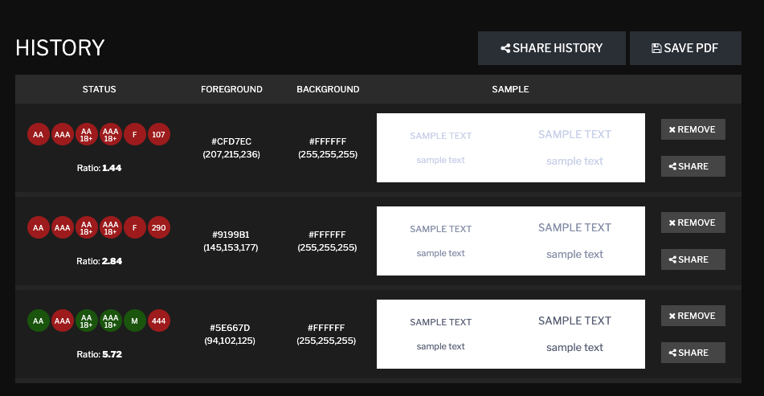

# Accessibility

Accessibility is like flossing: everyone knows it's important, but it
tends to get neglected in the rush to get things done. 

Yet, accessibility doesn't have to come at the expense of productivity,
or other things like usability. Just like squashing bugs, it is easier
to bake in accessibility at the beginning than it is to retrofit later
in the process. Making features more accessible also improves usability
for all users, not just those with disabilities.

This is meant to be an evolving document, to highlight best practices
and recipes for accessibility.

## Aspects of Accessibility

### Inputs

1.  Prefer built-in HTML input elements, because browsers and screen
    readers automatically make those accessible out-of-the-box
2.  If you decide to a third-party UI component library, check its level
    of accessibility as part of your evaluating whether to choose it
3.  If you need to build a custom input UI component, like a day-of-week
    picker, write it with accessible best practices.

#### Best Practices for Inputs

-   Use native input elements as much as possible (yes, it bears
    repeating)
-   Every input needs a visible **native** `<label>` element associated
    with it.
-   You can associate a `<label>` to its input either with a
    for-attribute (htmlFor in React JSX) with a value of the ID
    attribute of the input element.
-   You can also associate a `<label>` to its input by wrapping the
    input somewhere inside the label element's opening and closing tags.
    (This may require some layout and styling adjustments, but for
    3rd-party widgets that don't allow you to set their ID attribute,
    this is your only option.)
-   Placeholder attributes don't work as labels. In fact, they are often
    inaccessible themselves, and should be used sparingly, for example
    text. NEVER use a placeholder instead of a label.

  

### Color Contract

1.  Colors that seem very stark next to each other could actually be
    hard-to-read for people with various kinds of color blindness, which
    comes in forms and represent a non-trivial portion of the
    population. (Types of color
    blindness: <https://webaim.org/articles/visual/colorblind#types>)
2.  Even too subtle shades of gray on white or black could be hard for
    people without perfect vision to see. (Types of low
    vision: <https://webaim.org/articles/visual/lowvision#types>)
3.  Smaller text has more stringent contrast requirements than larger
    text. (Tool that allows you to enter text
    size: <https://accessible-colors.com/>)

#### Best Practices for Color Contrast

-   Smoke-test designs by changing your display to grayscale.
-   Check foreground/background color combinations with a contrast
    checker. (One that allows hex and RGB
    input: <https://contrastchecker.com/>)
-   Rule of thumb: AAA color contrast is nice, but at least meet the AA
    standard for color contrast

Example test with three of our color variables:  

  

## Resources

### Courses

-   W3C's "Introduction to Web
    Accessibility",<a href="https://www.edx.org/course/web-accessibility-introduction" class="external-link"> https://www.edx.org/course/web-accessibility-introduction</a>
-   Google and Udacity's free joint course, "Web
    Accessibility", <https://www.udacity.com/course/web-accessibility--ud891>

  

## Attachments:

 [Screen
Shot 2019-09-04 at 12.06.26 PM.png](attachments/868548629/874054287.png)
(image/png)  

Document generated by Confluence on Oct 19, 2021 14:18

[Atlassian](http://www.atlassian.com/)

